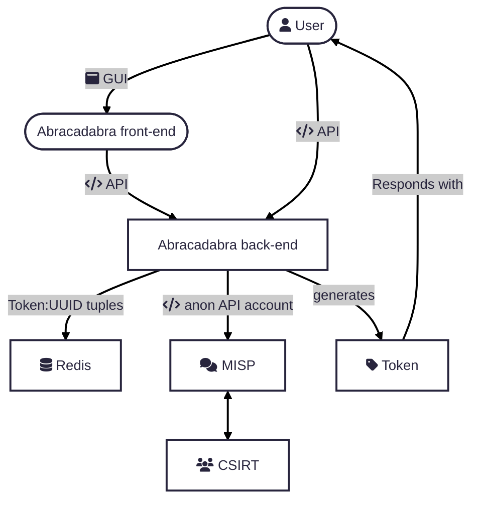

### Early builds of Abracadabra, the (anonymous) cybersecurity submission tool.

- The intent of the application is to act as an entry point into sharing communities / reporting portal for CSIRTs
- No prior contact is required, the tool allows for anonymous submissions to MISP
- Users of the tool will receive tokens for each submission that they can use to keep track of the evolution of their reports

- This is the back-end of the application, with the frontend being found here:

